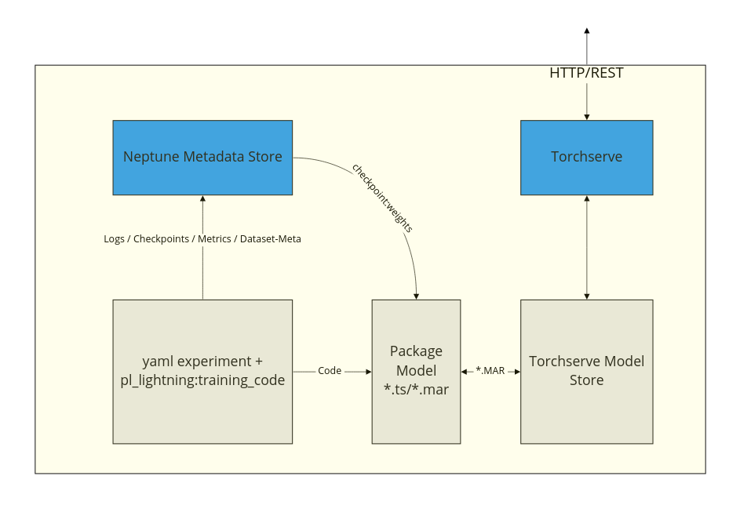

### Description


This repository implements a very simple but powerful training+monitoring+deployment flow for a simple computer vision
application (classification)  - but it should be relatively extendable to other problems.

It uses:

- pytorch_lightning (yaml+cli API) for training
- pl.LightningDataModule to separate model from data
- torchserve (to serve the packaged model)
- neptune.ai (to monitor experiments, store metadata, and checkpoints-weights)

If you dont want to use neptune as the metadata store or you use something else like WnB you will have to adjust some parts of the code
(especially how the weights are fetched during packaging)

The main features are:

- its simple and not bloated with complicated tools and flows.
- run experiments from a pre-defined YAML config that is easy to change(./experiment_configs/)
- deployment and usage of the model should be easily done using the uploaded checkpoints and config files.
- use different base models (from different packages)
- model packaging is aware of the type of model that is trained and the pre and post-processing steps can be adjusted.
  for instance, if your model needs different normalization you can make torchserve to be aware of that.
- (almost)everything is logged and reproducible




### setup


```bash
get your API token from neptune.ai

export NEPTUNE_TOKEN
export NEPTUNE_PROJECT
```

### Train a model

The experiment here is a simple cat vs dogs classification. For running the experiments the new pytorch_lightning CLI
API is used. It's very convenient to keep the experiment mess under control.

example pytorch_lightning yaml file:

```YAML

model:
  class_path: model.PlClassificationModel
  init_args:
    backbone_lr: 0.0001
    classifier_lr: 0.001
    base_model: resnet18
    backbone_pretrained: True
    num_classes: 2
    pooling: max
    normalize_pool: false
    clf_head: standard
    checkpoint_monitor: val/f1_macro
    optimizing_strategy: regular1 #cycling #
    label_smoothing: 0.0

data:
  class_path: data.AllClassesBalanced
  init_args:
    path_to_labels_df: './datasets/catsvsdogs_small.df.pickle'
    base_path: './datasets/catsvsdogs_small_images'
    batch_size: 16
    image_size: 224
    augmentation_strategy: hard_1
    train_workers: 2

```

```bash

python trainer.py --config experiment_configs/base.yaml --trainer.max_epochs 10  --trainer.limit_train_batches 10

```

### Package a model

The packaging does the following things:

- Fetch experiment **yaml** and best checkpoint from **neptune.ai**
- trace the model, create a torchscript file
- package the model to a *.mar file using PyTorch-model-archiver
- adds torchserve_cusom_handler and pre_post_processing to the archive.


```bash
python package_for_torchserve.py  --experiment_name DEM-11  --model_store_path ./model_store
```

### Start torchseve

```bash
torchserve --start --model-store ./model_store --models DEM-11=./model_store/DEM-11.mar
```

### Test torchserve

```bash
curl http://127.0.0.1:8080/predictions/DEM-11  -T /home/i008/6049_2.png 
```


### Use the model in a notebook for debugging, playing around

```python
from package_for_torchserve import load_model_from_config
model, data = load_model_from_config(config_path, checkpoint_path)

model # regular pl.LightningModule 

```
